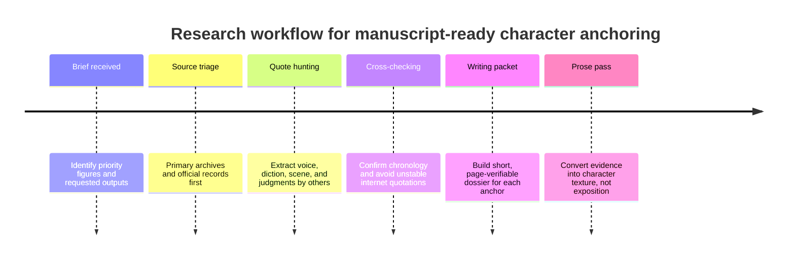

# Archival Research Dossier for Historical Monetary Anchor Characters

## Executive Summary

The uploaded brief turns the apparently “unspecified” request into a concrete, manuscript-facing research task: assemble citation-backed material for a prose pass built around five historical/economic-political anchors, with **entity["people","Paul Volcker","us central banker"]** as the first priority, **entity["people","John Maynard Keynes","british economist"]** second, and **entity["people","Thomas Attwood","birmingham reformer"]**, **entity["people","William Paterson","bank founder"]**, and **entity["people","Edward Backwell","goldsmith banker"]** as secondary targets. The brief specifically asks for quotable primary material, physical or social texture, and the opinions others held of these figures, in service of a later “Phase 4 prose pass.” fileciteturn0file0L5-L27

The strongest immediately usable archival lanes are Volcker and Keynes. For Volcker, the best writing packet combines his memoir **entity["book","Keeping At It","2018 memoir"]**, official Federal Reserve/FRASER material, and a small amount of contemporaneous reportage: these sources capture the October 6, 1979 regime shift, his emphasis on breaking “inflationary psychology,” and his awareness that debt stress in key borrowing countries made anti-inflation policy globally dangerous. For Keynes, the highest-yield combination is the Bretton Woods conference proceedings, his reproduced House of Lords defense of the agreements, and a first-rate historical synthesis such as **entity["book","The Battle of Bretton Woods","2013 history"]**; together they provide both page-verifiable rhetoric and scene-setting evidence about his deteriorating health and public stature at Bretton Woods. citeturn0search0turn0search15turn0search17turn8view0turn8view1turn12view0turn12view2turn15search6

Attwood is also a productive archival target because his speeches and letters survive in accessible form and preserve a distinctive rhythm: legalistic, moral-force radicalism paired with obsessive monetary reform. Paterson and Backwell are usable, but they require more caution. Paterson’s grand, projector-style language is well attested in collected writings and Darien histories, but his most famous banking quote has a shaky transmission history and should be page-verified before it enters polished prose. Backwell is historically important and well documented, yet the richest character texture is dispersed across later archive descriptions, city-history reference material, and diary references rather than a single canonical self-authored text. citeturn18view0turn22view0turn22view1turn24search0turn24search12turn32view1turn33view1turn36search4turn37search14

The practical conclusion is straightforward: if the immediate goal is manuscript utility rather than exhaustive historiography, the next writing pass should extract and page-check roughly a dozen passages—four for Volcker, four for Keynes, two for Attwood, and one each for Paterson and Backwell. That allocation matches both the uploaded priority order and the actual yield of the source landscape. fileciteturn0file0L25-L27 citeturn0search17turn8view0turn18view0turn32view1turn36search4

## Scope and Methodology

The brief asks for quotations, speech patterns, observed mannerisms, and judgments by contemporaries or near-contemporaries. It also prioritizes primary and official materials, with secondary scholarship used to triangulate context and locate the richest passages. I therefore weighted sources in this order: official archives and proceedings first; historical editions, hearings, and diaries second; peer-reviewed or major scholarly histories third; heritage/reference material only where it helped identify archival leads or establish documentary significance. fileciteturn0file0L13-L27 citeturn8view0turn8view1turn33view0turn33view1turn36search4

Because this is a historical-literary research problem rather than a biomedical one, the most productive discovery environments were FRASER, Hansard/Parliament, Bank of England and DMO history pages, Google Books/Internet Archive scans, and scholarly discovery routes that surface work like Asa Briggs’s article on Attwood and Henry Miller’s article on Birmingham currency reformers. A PubMed pilot search is still useful as a negative control, but it mainly surfaces later public-health and globalization pieces about “Bretton Woods institutions,” not the historical conference, nor the requested character dossiers. citeturn24search12turn24search0turn16search0turn38search0turn38search3turn38search6

The default assumptions from the meta-request were English-language delivery, an academically literate audience, and an APA-style bibliography. One default assumption should be explicitly overridden: a “recent ten-year” window is inappropriate here, because the uploaded task is inherently archival and depends on seventeenth-, nineteenth-, and mid-twentieth-century evidence. The correct recency rule is therefore “use the newest scholarship that illuminates older primary material,” not “exclude older sources.” fileciteturn0file0L5-L27 citeturn8view0turn18view0turn32view1

## Evidence Map

| Anchor | Highest-confidence sources | Source class | Immediate writing value |
|---|---|---|---|
| Volcker | Volcker memoir; FRASER Volcker Papers; Federal Reserve history pages. citeturn0search0turn0search17turn0search15 | Memoir + official archive + institutional history | Best for anti-inflation diction, 1979 turning-point chronology, and his own framing of risk. |
| Keynes | Bretton Woods proceedings; Senate hearings reproducing his Lords speech; major scholarly synthesis. citeturn8view0turn8view1turn12view0turn12view2turn15search6 | Official proceedings + parliamentary record + high-end history | Best for quotable rhetoric, conference atmosphere, and bodily strain under pressure. |
| Attwood | Hansard 1839; Wakefield’s text-rich biography; modern scholarship on Birmingham currency reform. citeturn18view0turn18view1turn22view0turn22view1turn24search0turn24search12 | Parliamentary record + historical biography + peer-reviewed interpretation | Best for voice, slogans, crowd politics, and his mix of legality, reformism, and monetary obsession. |
| Paterson | Collected writings; Darien histories; official Bank/DMO histories of the Bank’s founding. citeturn32view1turn33view0turn33view1 | Collected primary writing + official institutional history | Best for visionary “projector” rhetoric and the scale of his commercial imagination. |
| Backwell | NatWest heritage note; city-history reference entries; Pepys-related diary references. citeturn36search4turn36search2turn37search0turn37search14 | Official archive note + reference history + diary trail | Best for social embedding and period texture, less strong for self-authored voice. |

Two patterns emerge from this map. First, the richest prose-support material comes where a figure left behind either formal public speeches or retrospective self-explanation; this strongly favors Volcker, Keynes, and Attwood. Second, the most “internet-famous” quotations are not always the safest; Paterson is the clearest case, because the line about a bank creating money “out of nothing” is widely circulated and even cited in later parliamentary debate, but it still deserves direct confirmation in the printed collected writings before it is used as a clean primary quotation. citeturn30search15turn31search13turn32view1

For scene-building, the archival record is already strong enough to sustain real character texture. Keynes’s official Bretton Woods remarks define the conference as a task requiring “wisdom,” “statesmanship,” and “good will,” and describe a world community forged in war; the same source gives him a public, elevated cadence, while later historical synthesis captures the visible decline in his health. Attwood’s surviving speeches, by contrast, show a leader who converted mass politics into moral-force legality, insisting that within the law the people are “strong as a giant” and beyond it “weak as an infant.” Volcker’s most distinctive tone is cooler and narrower-gauge: institutional, anti-romantic, and preoccupied with credibility, expectations, and contagion. citeturn9view1turn9view3turn12view0turn15search6turn22view0turn0search17turn0search15

## Annotated Bibliography

**entity["people","Christine Harper","financial journalist"] & Volcker, P. A. (2018). _Keeping At It: The Quest for Sound Money and Good Government_. PublicAffairs.** This is the cleanest single retrospective source for Volcker’s own mature self-understanding. It is especially useful for phrasing and interpretive framing, but manuscript use should still be paired with page-checked official materials when the prose needs exact chronology or precise 1979–82 diction. citeturn0search0turn0search17

**Federal Reserve Bank of St. Louis, FRASER. _Volcker Papers, 1979–1987_.** The FRASER collection is the most important institutional archive for manuscript-grade Volcker work because it anchors memoir language to documentary context and preserves his own discussion of breaking “inflationary psychology.” It should be the first stop for page-verifiable citations beyond the memoir. citeturn0search17

**entity["organization","Federal Reserve","us central bank"] History. “Volcker’s Announcement of Anti-Inflation Measures.”** This is the best short official explainer for the October 6, 1979 policy pivot. It is ideal for establishing the significance of the Saturday-night announcement and for linking narrative scene-setting to institutional chronology. citeturn0search1

**United States Department of State. (1948). _Proceedings and Documents of the United Nations Monetary and Financial Conference, Bretton Woods, New Hampshire, July 1–22, 1944, Volume I_.** This is the core official source for Keynes at Bretton Woods. It provides verbatim conference language, including Keynes’s opening remarks on reconstruction and development and the broader moral register of the conference. citeturn8view0turn9view1turn9view3

**United States Senate Committee on Banking and Currency. (1945). _Bretton Woods Agreements Act: Hearings on H.R. 3314_.** The hearings reproduce Keynes’s House of Lords defense of the Bretton Woods plan, including memorable lines about convertibility, “little Englandism,” and creditor-country responsibility. This is indispensable for capturing his public polemical voice in 1944–45. citeturn8view1

**entity["people","Benn Steil","economic historian"]. (2013). _The Battle of Bretton Woods: John Maynard Keynes, Harry Dexter White, and the Making of a New World Order_. Princeton University Press.** Among modern secondary works, this is the most useful single narrative synthesis for conference atmosphere, personal friction, and Keynes’s physical decline. It is not a substitute for the official proceedings, but it is a superb bridge between documented event and scene-writing. citeturn11view2turn12view0turn12view2turn15search6

**entity["people","David Moss","historian"]. (1990). _Thomas Attwood: The Biography of a Radical_. McGill-Queen’s University Press.** Moss is the best modern single-author study of Attwood for voice, parliamentary reputation, and the political culture of Birmingham monetary reform. It is especially useful because it keeps Attwood from collapsing into caricature. citeturn18view3turn19view1turn19view2

**entity["people","C. M. Wakefield","biographer"]. (1885). _Life of Thomas Attwood_. Harrison & Sons.** Wakefield is older, but for manuscript purposes it is immensely valuable because it reproduces long passages of Attwood’s speeches and letters. That makes it one of the highest-yield quote mines in the entire dossier, particularly for “peace, law, order, loyalty, and union.” citeturn20view0turn21view0turn22view0turn22view1

**entity["people","Asa Briggs","historian"]. (1948). “Thomas Attwood and the Economic Background of the Birmingham Political Union.” _The Economic History Review_.** This peer-reviewed article remains important because it captures the long-running scholarly judgment that Attwood was too often dismissed as a monetary crank. It is especially useful for balancing crowd rhetoric with serious historical interpretation. citeturn24search12

**Paterson, W., & entity["people","Saxe Bannister","editor"] (Ed.). (1859). _The Writings of William Paterson, Founder of the Bank of England, and of the Darien Colony_.** This is the key collected source for Paterson’s own language. It is the place to verify any famous banking quotation and the best route into his genuinely grandiose Darien rhetoric about trade, oceans, and empire. citeturn26search0turn32view1

**UK Debt Management Office. “Bank of England.”** This official history is not a substitute for Paterson’s own writings, but it is excellent for concise institutional framing of the Bank’s origin, the funded national debt, and Paterson’s role in proposing a “Bank of England” and a “fund for perpetual Interest.” citeturn33view1

**entity["organization","NatWest Group","uk bank"] Heritage Hub. “Edward Backwell.”** This is the best concise official anchor for Backwell’s documentary importance because it links him directly to surviving banking archives and to his place in early English banking history. For archival planning, it is more useful than many generic reference entries. citeturn36search4

## Synthesis and Writing Guidance

For Volcker, the writing opportunity is not just policy detail but psychological posture. The documentary record supports a voice centered on credibility, discipline, and fear of embedded expectations; FRASER material ties him to the need to break “inflationary psychology,” and available testimony/search material shows that he was fully aware that tight policy could amplify the debt vulnerability of major borrowing countries. That combination matters for fiction or interpretive prose because it lets him read as morally austere but not naively domestic—someone who saw the international blast radius and proceeded anyway. If physical color is needed, contemporary obituaries and profiles preserved the public image of a very tall, cigar-associated inflation fighter, but those stock tags should be used sparingly next to his actual language. citeturn0search17turn0search15turn2search14

For Keynes, the archive offers both rhetoric and vulnerability. The official proceedings give him elevated, almost civilizational phrasing: the world as community, reconstruction as urgent duty, expansion as the opposite of inflation, and creditor responsibility as central to stability. At the same time, later historical synthesis and quoted contemporaries record how visibly fragile he became during the conference, with colleagues feeling his health stood “on the edge of a precipice.” That pairing—lofty public language and a body under strain—is probably the single best piece of character texture in the whole packet. citeturn8view0turn8view1turn9view1turn9view3turn12view0turn15search6

For Attwood, the surviving materials reveal a voice that is more disciplined than caricature usually allows. In Parliament he spoke in the language of justice to laboring people, unequal burdens, and “money-law”; at mass meetings and in letters he returned obsessively to legality, union, and organized pressure rather than romanticized insurrection. The best manuscript use would lean into this combination: a man capable of huge crowds and “giant” imagery who nevertheless insists that political strength exists only when it remains inside the law. The modern scholarly literature is useful here chiefly as a guardrail against flattening him into mere “monomania,” even though that was a famous hostile judgment from Westminster. citeturn18view0turn18view1turn22view0turn22view1turn24search0turn24search12turn24search17

For Paterson, the safest usable trait is magnitude of imagination. The Darien materials preserve a mind that thinks in continents, sea-lanes, and total re-routing of world commerce; phrases like “trade will increase trade” and “money will beget money” are exactly the sort of compact, internally musical language that can carry an anchor character on the page. What should be resisted is the temptation to use the most viral banking quotation without checking it in the collected writings. The phrase about the bank having the benefit of interest on money created “out of nothing” is important as a historical afterlife and may well be authentic, but the standard for prose with citations should be stricter than internet circulation. citeturn32view1turn30search15turn31search13

For Backwell, the evidence is less about rhetoric than placement in a financial ecology. Official archive notes and city-history references mark him as a major early banker, while Pepys-related materials show him functioning as a practical banker in everyday and state-financial contexts. The stray line that he was “the frankest of the money men,” while small, is exactly the kind of social texture that can do real work in prose. Backwell should therefore be written less as a theorist than as a trusted node—visible through the traffic of money, confidence, and government dependence. citeturn36search4turn36search6turn37search0turn37search14

## Open Questions and Replicable Queries

The main limitations are not thematic but bibliographic. Volcker’s exact page-level memoir passages on international debt exposure still need print or scan confirmation. Keynes’s most vivid health material is easy to locate in later historical synthesis and quoted memoir language, but a final manuscript should pin those moments to Robbins, Skidelsky, or the underlying archival documents. Paterson’s famous “out of nothing” line remains the biggest authenticity check in the packet. Backwell is well documented, but his character dossier still needs a fuller dip into diary entries, civic records, and surviving ledgers before it reaches the same vividness as the Volcker, Keynes, and Attwood files. citeturn0search15turn12view0turn15search6turn31search13turn36search4

For replicability, the best search strings and filters are these:

| Target | Suggested query | Best filter | Expected payoff |
|---|---|---|---|
| Volcker | `"Paul Volcker" inflation psychology site:fraser.stlouisfed.org` | Official site only | Quotable late-1970s/early-1980s language |
| Volcker | `"Paul Volcker" "Argentina" OR "Brazil" debt site:fraser.stlouisfed.org` | 1979–1983 | International-risk framing |
| Keynes | `"Keynes" Bretton Woods proceedings FRASER` | Exact phrase | Official conference text |
| Keynes | `"Keynes" "little Englandism" Bretton Woods hearings` | Exact phrase | High-value polemical quote |
| Attwood | `"Thomas Attwood" Hansard 1839 National Petition` | Parliamentary record | Exact parliamentary cadence |
| Attwood | `"Thomas Attwood" "peace, law, order, loyalty, and union"` | Scan/OCR sources | Signature slogans and letters |
| Paterson | `"William Paterson" Darien "trade will increase trade"` | Scan/OCR sources | Projector rhetoric |
| Paterson | `"William Paterson" "benefit of interest" Bannister` | Exact phrase | Quote-authentication check |
| Backwell | `"Edward Backwell" Pepys banker` | Diary/reference sources | Social texture and trust language |
| PubMed control | `"Bretton Woods"[Title/Abstract]` | Title/abstract | Confirms domain mismatch for archival character work |

The central recommendation is therefore narrow and practical: treat this as an archival source-harvesting exercise, not a broad literature review. The evidence already supports a high-confidence first dossier for Volcker, Keynes, and Attwood; Paterson and Backwell are viable next, but only after quote verification and a more targeted pass through scanned editions and diary material. fileciteturn0file0L13-L27 citeturn0search17turn8view0turn18view0turn32view1turn36search4